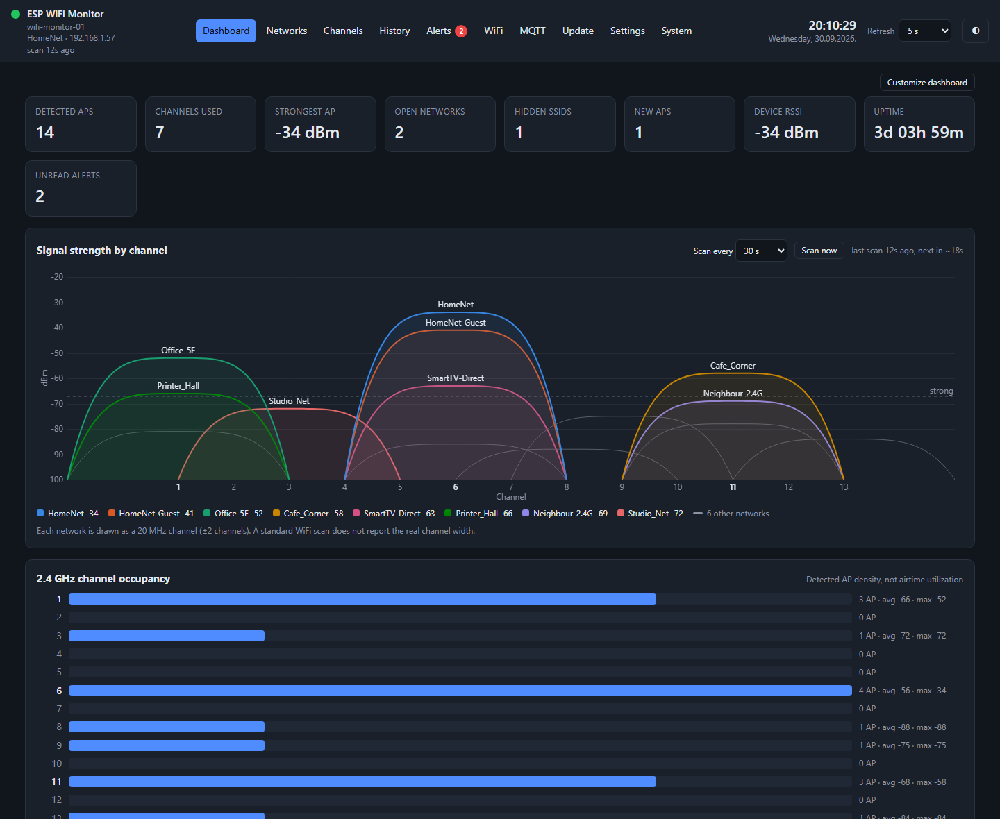
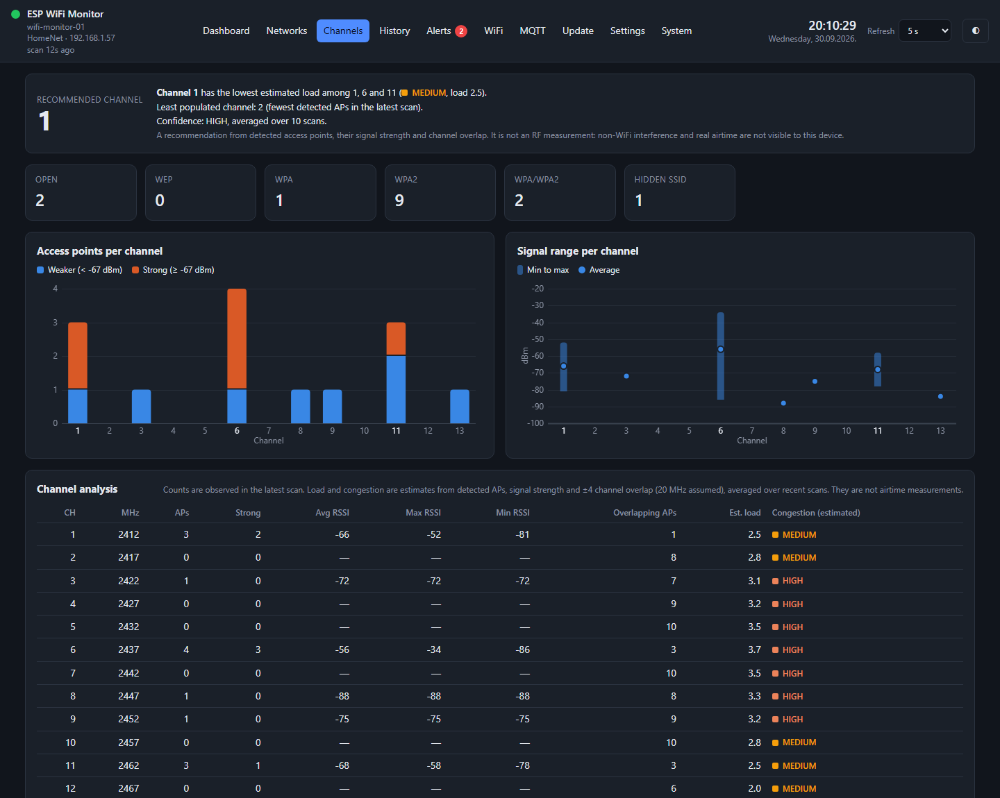
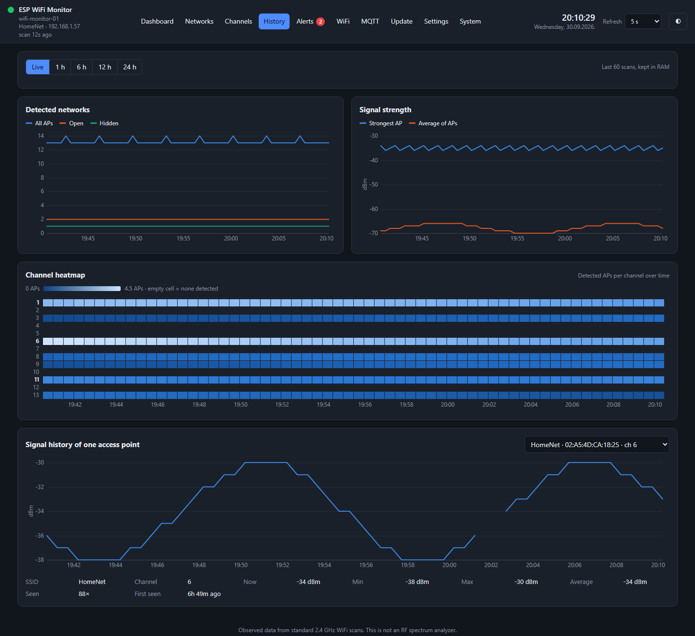
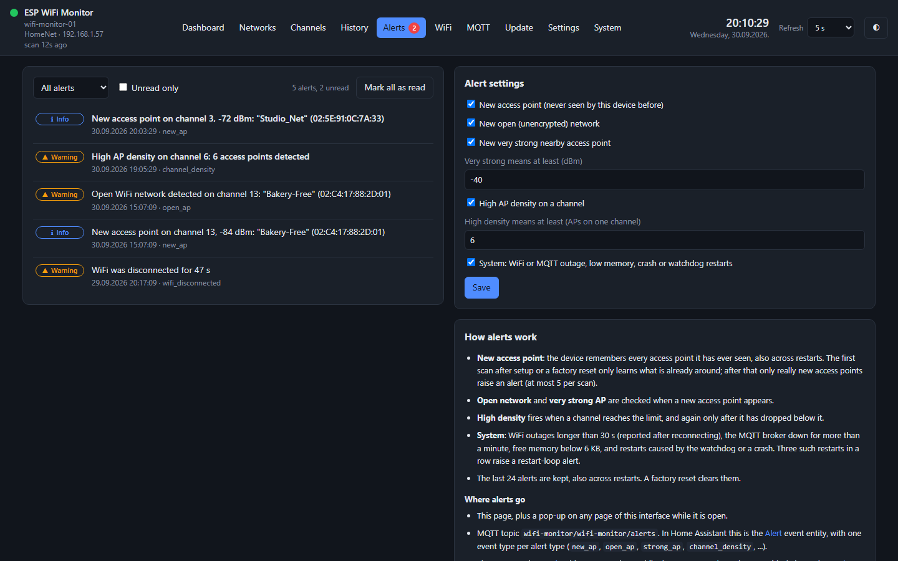
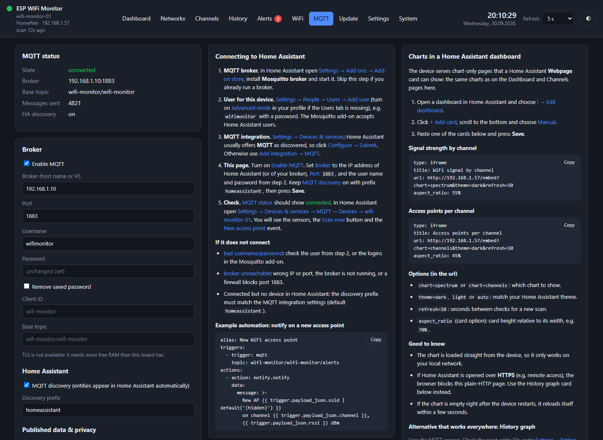
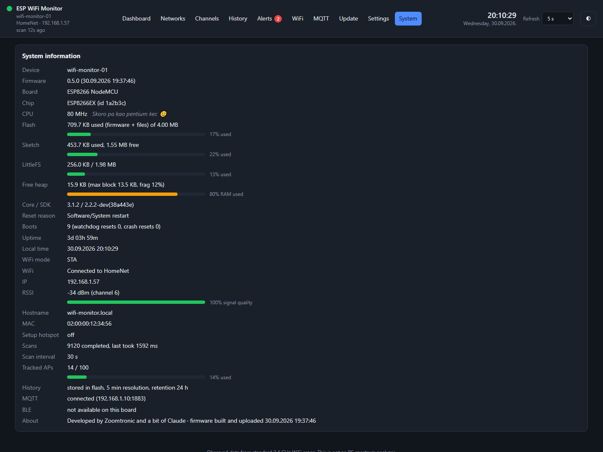

# ESP WiFi Monitor

A small, standalone **2.4 GHz WiFi monitor and channel analyzer** that runs entirely on an
**ESP8266 NodeMCU** or an **ESP32-C3** (with Bluetooth LE). It scans the networks around it, keeps statistics and history, shows everything
in a web interface hosted on the device, and integrates with **Home Assistant over MQTT**. It needs no
cloud, PC, Raspberry Pi or Docker.

> Developed by Zoomtronic and a bit of Claude.

One code base, one web UI and one MQTT structure for both boards. Board differences are isolated in a small
platform layer.



---

## Screenshots

> The screenshots use invented networks and MAC addresses; no real neighbourhood data is shown.

| Channels | History |
|---|---|
|  |  |

| Alerts | MQTT / Home Assistant |
|---|---|
|  |  |

| System |
|---|
|  |

---

## Features

**Scanning & statistics**
- Periodic asynchronous WiFi scan (10 s – 30 min, or manual), optionally limited to one channel
- Per access point: SSID, BSSID, channel, frequency, security, hidden flag, current / min / max / average
  RSSI, first/last seen, seen count, and on the ESP32-C3 the channel width (20/40 MHz) and WPA3
- Up to 100 tracked APs by default (configurable)

**Web interface** (served from the device, vanilla JS + canvas charts)
- **Dashboard**: summary widgets, *signal strength by channel* chart (each AP drawn with its 20/40 MHz width),
  channel occupancy, strongest networks. Widgets can be hidden per browser
- **Networks**: sortable/filterable table, search, pagination, CSV/JSON export
- **Channels**: APs per channel, signal range, overlap, *estimated* congestion and a recommended channel
  (1/6/11)
- **History**: live view (last 60 scans) and stored history (5-minute buckets, up to 7 days), channel
  heatmap, per-AP signal history
- **Alerts**: new / open / very strong access points, high AP density on a channel, WiFi or MQTT
  outages, low memory, watchdog/crash restarts. Shown in a list and as pop-ups
- **WiFi**: pick the network from a scan list (also works in the setup hotspot)
- **MQTT**: broker settings, a Home Assistant setup guide and ready-to-paste dashboard cards
- **Update**: OTA firmware and web-file updates from the browser
- **Settings / System**: device, network (DHCP or static IP), scanner, history, appearance, backup/restore,
  factory reset; resource usage bars and reset counters
- Light/dark theme, date/time format `DD.MM.YYYY HH:MM:SS`

**Home Assistant (MQTT discovery)**
- Sensors: AP count, strongest/average signal, open/hidden networks, channels used, APs on channels
  1/6/11, recommended channel, congestion on 1/6/11, WiFi RSSI, uptime, scan count, free heap
- Binary sensors: *New AP*, *Alert*
- Buttons: *Scan now*, *Mark alerts as read*
- Event entity *Alert* with one event type per alert type
- Chart-only page `/embed` for a Home Assistant *Webpage* (iframe) card

**Bluetooth LE** (ESP32-C3)
- **BTHome** advertising: Home Assistant discovers the device over Bluetooth by itself (WiFi APs, BLE devices
  nearby, recommended channel), no pairing or MQTT needed
- Passive scan of nearby BLE devices (address, name, maker, RSSI) on its own **BLE** page, with a signal
  bar chart of the devices in range and a signal-over-time chart
- GATT service with a JSON summary, readable with any BLE app (e.g. nRF Connect)

**System**
- Setup hotspot with captive portal on first boot or when the WiFi is unreachable
- mDNS (`http://wifi-monitor.local`), NTP time with a configurable time zone
- Watchdog, reset-reason and restart-loop tracking
- OTA updates that check the version and target board before activating the image
- Factory reset from the web page, the serial console, or by holding the **FLASH** button for 10 s

---

## Hardware

| Board | PlatformIO env | Notes |
|---|---|---|
| ESP8266 NodeMCU (ESP8266EX, 4 MB flash) | `nodemcuv2` | WiFi only, ~16 KB free RAM |
| ESP32-C3 mini with 4 MB flash and native USB | `esp32c3` | WiFi + BLE, reports WPA3, ~70 KB free RAM |

Plus a USB cable and a 5 V USB power supply. No other hardware is needed.

---

## Important limitations

The ESP8266 is a WiFi client chip, not a spectrum analyzer. This project reports what a standard WiFi
scan can see and labels anything else as **Detected**, **Estimated** or **Unknown**:

- **2.4 GHz only** (both boards). 5 GHz and 6 GHz networks are not visible.
- **No real airtime/channel utilization.** Congestion is an *estimate* from detected APs, their signal
  strength, 20 MHz channel overlap and repeated scans.
- **Channel width**: reported by the ESP32-C3 scan (20/40 MHz). The ESP8266 scan does not report it, so there
  charts assume 20 MHz and the table shows *Unknown*.
- **ESP8266 only**: WPA3 cannot be distinguished (reported as WPA2), channel width unknown, no Bluetooth, no
  TLS for MQTT (not enough free RAM).
- WiFi and BLE share one radio on the ESP32-C3, so WiFi and BLE scans take turns.

The web interface has **no login**. The device is meant for a trusted local network only. **Never expose
it to the internet.** POST requests require an `X-Requested-With` header, which protects against
cross-site requests from other websites.

---

## Getting started

### 1. Build and flash

Install [PlatformIO](https://platformio.org/) (CLI or VS Code extension), then:

```sh
git clone https://github.com/zoomtronicOR/ESP8266-32.git
cd ESP8266-32

# set upload_port / monitor_port in platformio.ini to your serial port (e.g. COM9 or /dev/ttyACM0)
pio run -e esp32c3 -t upload       # firmware (or -e nodemcuv2 for the ESP8266)
pio run -e esp32c3 -t uploadfs     # web interface (LittleFS image from data/). Only for the first install!
```

> `uploadfs` writes a fresh file system and **erases the saved settings and history**. For later web
> updates use the Update page or `tools/update_web.py` (see below).

### 2. First boot

1. The device opens the WiFi hotspot **`ESP-WIFI-MONITOR-xxxx`**. Connect with a phone or laptop.
2. The setup page opens automatically (otherwise open `http://192.168.4.1/wifi`).
3. Pick your 2.4 GHz network, enter the password, press **Connect**.
4. The page shows the device's new address on your network. The hotspot switches off after a few minutes.

Then open `http://<device-ip>/` or `http://wifi-monitor.local/`.

### 3. Home Assistant (optional)

1. Install the **Mosquitto broker** add-on and create a user for the device.
2. Add the **MQTT** integration in Home Assistant.
3. On the device's **MQTT** page, enter the broker address, port and user, keep *MQTT discovery* on, and save.
4. The device appears under *Settings → Devices & services → MQTT*.

The MQTT page has a step-by-step guide, an example automation and ready-made dashboard cards.

---

## Updating

| What | How |
|---|---|
| Firmware | Build with `pio run`, then upload `.pio/build/<env>/firmware.bin` on the **Update** page |
| Web files | Select the `data` folder on the **Update** page |
| Web files from the PC | `python tools/update_web.py --http <device-ip>` (over WiFi, ~5 s) |
| Web files over USB (ESP8266) | `python tools/update_web.py COM8` (reads, patches and rewrites the file system) |
| Firmware from the PC | `curl -H X-Requested-With:wifi-monitor -F file=@.pio/build/<env>/firmware.bin http://<device-ip>/api/update/firmware` |

All of these keep the settings, history and alerts. The firmware carries a tag
(`ESPWM-FW|<version>|<board>|`). Uploads without the tag, or built for another board, are refused, and
the running firmware stays.

---

## MQTT topics

Base topic: `wifi-monitor/<hostname>` (configurable). Payloads are JSON.

| Topic | Content |
|---|---|
| `availability` | `online` / `offline` (retained, last will) |
| `status` | IP, firmware, free heap |
| `uptime`, `rssi`, `ap_count`, `channel_count` | `{"value": …, "timestamp": …}` |
| `scan` | Latest scan summary (detected, open, hidden, strongest, average, …) |
| `channels` | APs, estimated load and congestion per channel, recommended channel |
| `networks` | AP list (privacy options: hide SSIDs, anonymize BSSIDs) |
| `new_ap`, `alert` | `ON` / `OFF` (retained) |
| `alerts` | One message per alert (`event_type`, `severity`, `message`, …) |
| `ble` | BLE devices nearby and strongest RSSI (ESP32-C3) |
| `cmd` | Send `scan` or `ack_alerts` |

---

## REST API (short)

| Method | Endpoint | Purpose |
|---|---|---|
| GET | `/api/status` | Device, WiFi, scan, history, MQTT, alerts summary |
| GET | `/api/networks` | Tracked APs (`?present=1`, `?offset=`, `?limit=`) |
| GET | `/api/channels` | Per-channel counts, estimated load/congestion, recommendation |
| GET | `/api/history` | Stored history (`?hours=`), incl. APs per channel |
| GET | `/api/history/live` | Last scans from RAM |
| GET | `/api/history/ap` | One AP's signal (`?bssid=` with `&live=1` or `&hours=`) |
| GET | `/api/alerts` | Alert list |
| GET | `/api/ble` | Recently seen BLE devices (ESP32-C3) |
| GET/POST | `/api/config` | Settings (partial updates; secrets are write-only) |
| POST | `/api/scan`, `/api/alerts/ack`, `/api/wifi/connect` | Actions |
| POST | `/api/update/firmware`, `/api/update/webfile?path=` | OTA |
| POST | `/api/reboot`, `/api/factory-reset` | Maintenance |

All POST requests need the header `X-Requested-With: wifi-monitor`.

---

## Serial console

115200 baud. Commands: `status`, `wifi "<ssid>" "<password>"`, `reboot`, `factory`, plus diagnostics
`ntp <server>` and `ntptest <host>`.

---

## Project structure

```text
src/            firmware modules (scanner, statistics, history, alerts, MQTT, BLE, web server, WiFi manager, ...)
src/platform.*  the only place with ESP8266 / ESP32 differences
include/        config.h (board definitions, limits, defaults)
partitions_esp32c3.csv  ESP32-C3 flash layout (two OTA slots + LittleFS)
data/           web interface (index.html, embed.html, css/, js/)
tools/          update_web.py (web update without data loss), build_info.py (build timestamp)
docs/images/    README screenshots (invented demo data)
```

---

## Roadmap

- [x] Phase 1: WiFi scan, network table, basic web server
- [x] Phase 2: charts, statistics, history (LittleFS)
- [x] Phase 3: MQTT, MQTT discovery, Home Assistant
- [x] Phase 4: alerts, new AP detection, channel analysis, heatmap
- [x] Phase 5: OTA, captive portal, advanced settings (web login intentionally left out: LAN-only device)
- [x] ESP32-C3 version with BLE: BTHome, BLE scan with signal charts, GATT (same web UI and MQTT structure)
- [x] Channel width (20/40 MHz) from the ESP32 scan, used in charts and congestion estimates

---

## License

[MIT](LICENSE) © 2026 Zoomtronic
